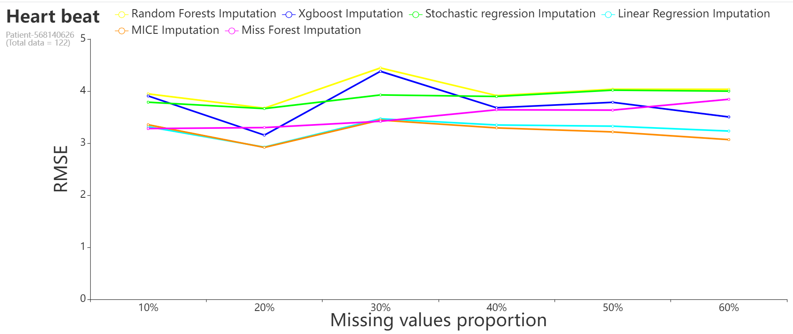
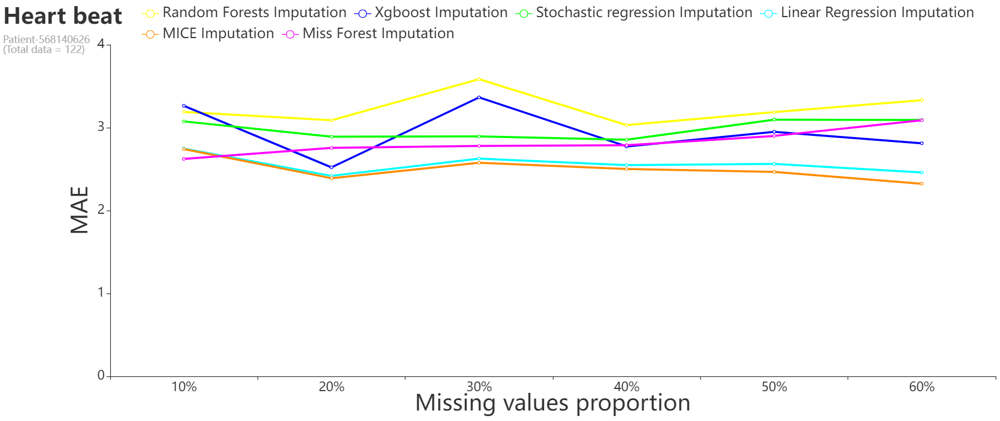
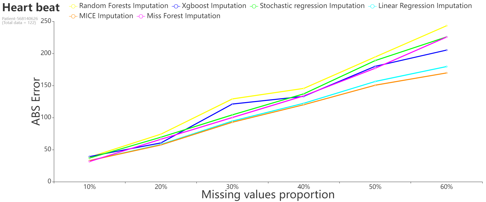

# Test of imputation functions on Heart Beat (with fake miss data) and Steps.
In this notebook I do tests on various data imputations functions using as evaluation parameter:
- Root Mean Square Error (RMSE),
- Mean Absolute Error (MAE),
- Absolute Error.

The functions I test are:
- Linear Regression Imputation,
- Stochastic Regression Imputation,
- Random Forest Imputation,
- Xboost Imputation,
- MICE Imputation,
- Miss Forest Imputation.

These functions have 'plotting' as a parameter, if this is set to True the function returns a visual report.

To do the tests I used the heart beat (with a percentage of fake random missing given from 10% to 60%) and the steps of a patient with an initial correlation between the two of 0.52.

Final results:

- Root Mean Square (RMSE):

  

- Mean Absolute Error (MAE):

  
  
- Absolute Error :
 
